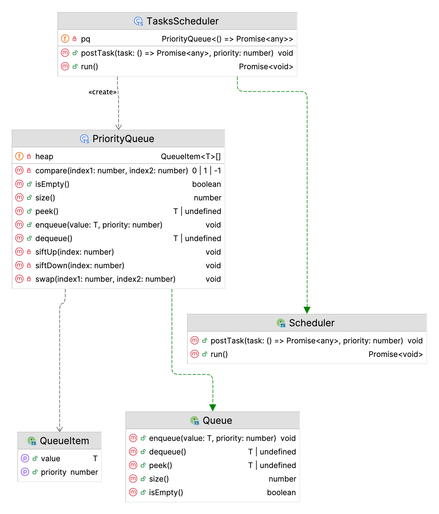

# 📚 Home Task

The home task must be done using TypeScript. In the `src` folder, create a dedicated file for each class, using the class name as the filename (e.g. `Shape.ts`). Make sure to export classes using [named export](https://developer.mozilla.org/en-US/docs/Web/JavaScript/Reference/Statements/export#using_named_exports), so they can be imported in tests.

## Requirements

You need to implement a task scheduler class with prioritization, similar to the [Scheduler API](https://developer.mozilla.org/en-US/docs/Web/API/Scheduler) provided by modern browsers.

The idea is that you have a queue of tasks, and you need to run them in the order of their priority. The task with the highest priority must be executed first. Priority is calculated via the numbers. The lower number - the higher the priority.

This task has two parts: the implementation of the priority queue class `PriorityQueue` and the implementation of the tasks scheduler class `TaskScheduler`.

### PriorityQueue

`PriorityQueue` must be implemented with the `min heap` algorithm. The class must have the following fields and methods:

- `private heap: QueueItem<T>[]`: heap
- `enqueue(value: T, priorty: number): void`: Adds a new item to the queue
- `dequeue(): T | undefined`: Removes item with the highest priority from the queue
- `peak(): T | undefined`: Returns item with the highest priority without removing it
- `size(): number`: Returns the heap size
- `isEmtpy(): boolean`: Checks if the heap is empty
- `private siftUp(index: number): void`: Maintains the min-heap property by bubbling the item (based on specified index) up the heap after insertion (see `enqueue()` method above)
- `private siftDown(index: number): void`: Maintains the min-heap property by bubbling the item (based on specified index) down the heap after removal (see `dequeue()` method above)
- `private swap(index1: number, index2: number): void`: Swaps two items in the heap based on their indices
- `private compare(index1: number, index2: number): 0 | 1 | -1`. Compares items (based on their indices) in heap based on their `priority`. It should return:
  - `0` when values are equal
  - `-1` when value of first item is lower than value of second one
  - `1` when value of first item is greater than value of second one

Public methods are described by `Queue` interface which `PriorityQueue` class must implement. Private fields and methods are provided here for reference. Autocode tests assume public and private fields and methods exist and are implemented according to the requirements above.

### TasksScheduler

`TasksScheduler` must implement the `Scheduler` interface.

The class must have the following fields and methods:
- `private pq: PriorityQueue<() => Promise<any>>`: priority queue
- `postTask(task: () => Promise<any>, priority: number): void`: Adds task to the priority queue
- `run(): Promise<void>`: Executes all tasks in the queue concurrently and returns a promise that resolves when all tasks executed. Method must contain logic to prevent breakage because of tasks that throw synchronous errors.

### Class diagram

Here is how the class diagram of the final solution might look like:

